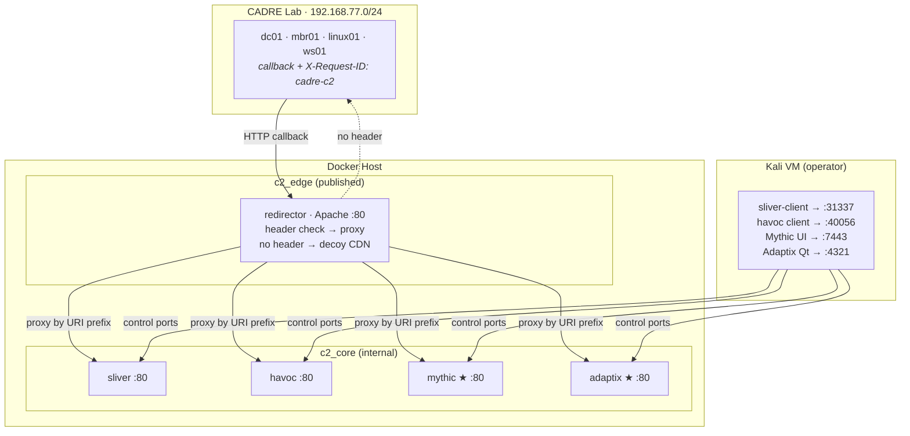

# C2Stack

<p align="center">
  
</p>

<p align="center">
  <a href="https://github.com/CADRE-Platform/C2Stack"></a>
  <a href="https://github.com/CADRE-Platform/C2Stack"></a>
  <a href="https://github.com/CADRE-Platform/C2Stack"></a>
</p>

Docker-first C2 Framework Training Environment — a containerized practice range that
turns any lab into a safe C2 playground.

C2Stack runs a header-aware **redirector** in front of four C2 frameworks as
Docker containers. Your existing **Kali VM** is the operator workstation — it runs
the C2 clients and attack tooling and reaches the frameworks through published ports.

- **Sliver + Havoc** — start by default. No extra flags needed.
- **Mythic** — profile-gated (`--profile mythic`). Pulls upstream image.
- **Adaptix** — profile-gated (`--profile adaptix`). Builds from source (~5 min first run).

No VMs, no Vagrant, no hypervisor required.

## Architecture



> ★ profile-gated — enable with `--profile mythic` / `--profile adaptix`

**Traffic flow:**
1. A payload on a victim calls back to `http://<host-ip-on-vmnet2>:<REDIRECTOR_HTTP_PORT>/<prefix>`
   with header `X-Request-ID: cadre-c2`.
2. The redirector validates the header → proxies to the matching C2 container on `c2_core`.
3. No valid header → serves a **decoy CDN page** (OPSEC).
4. The C2 containers live on an `internal` network — they have **no direct internet
   egress** and are only reachable through the redirector.

**Loki C2 (optional):**
Loki uses Azure Storage Blob as its C2 channel — agents talk directly to Azure,
bypassing the redirector entirely. It is out-of-band (not containerized) and best
suited for Azure hybrid AD environments where blob traffic blends in. Requires a
Storage Account + SAS token and outbound access to `*.blob.core.windows.net`.

## Quick Start

Prerequisites:
- Docker Desktop running on the host (Windows / Linux / macOS).
- A Kali VM as the operator workstation (you already have one).
- Host reachable from the CADRE lab network (vmnet2, 192.168.77.0/24).

```powershell
# Windows (Docker Desktop)
cd C2Stack\Docker
.\docker-bootstrap.ps1               # redirector + sliver + havoc (default)
.\docker-bootstrap.ps1 -Mythic       # also bring up Mythic
.\docker-bootstrap.ps1 -Adaptix      # also bring up Adaptix (builds from source)
.\docker-bootstrap.ps1 -All          # all four frameworks
```

```bash
# Linux / macOS
cd C2Stack/Docker
./docker-bootstrap.sh               # redirector + sliver + havoc (default)
./docker-bootstrap.sh --mythic      # also bring up Mythic
./docker-bootstrap.sh --adaptix     # also bring up Adaptix (builds from source)
./docker-bootstrap.sh --all         # all four frameworks
```

This copies `.env.example` → `.env` (review it), builds the images, and starts the
stack. The redirector publishes its victim-facing port; the C2 frameworks publish
their operator/control ports to the host.

## Using With CADRE

The CADRE lab VMs (dc01/dc02/mbr01/mbr02/linux01 on 192.168.77.0/24) are your practice
targets. They are already vulnerable — ACLs, SPNs, delegations, SMB signing disabled,
LDAP signing not required, and 60+ documented attack paths.

1. Start the stack (above). Note the Docker host IP on vmnet2.
2. Generate a payload from Mythic/Sliver/Havoc → point the callback to
   `http://<host-ip-on-vmnet2>:<REDIRECTOR_HTTP_PORT>` with header
   `X-Request-ID: cadre-c2` and the framework's URI prefix.
3. Deliver the payload to a CADRE target (SMB share, phishing, etc.).
4. Watch callbacks arrive through the redirector into the right C2 container.

See [`Doc/Docker.md`](Doc/Docker.md) for the full architecture, listener tuning, and
operator next steps.

## Components

| Container | Role | C2 port (internal) | Operator/control port (published) |
|-----------|------|:------------------:|----------------------------------:|
| `redirector` | Apache header-based proxy + decoy page | 80 (published) | — |
| `mythic` | Mythic server + http C2 profile | 80 | 7443 (UI) |
| `sliver` | Sliver teamserver | 80 | 31337 |
| `havoc` | Havoc teamserver | 80 | 40056 |
| `adaptix` | Adaptix teamserver + extenders (HTTP/S, DNS, SMB, TCP, Gopher) | 80 | 4321 (Qt GUI) |

All C2 frameworks share the `c2_core` internal network; only the redirector is
exposed. Configuration lives in `Docker/.env` (copy from `.env.example`).

### Adaptix C2 — Go-based post-exploitation framework

Adaptix is a Go/C++ post-exploitation framework with a Qt GUI client. Features:
- **Listeners:** HTTP/S, DNS/DoH, SMB, TCP Beacon + TCP/mTLS Gopher
- **Multi-user:** server/client architecture with multiplayer support
- **Extensible:** plugin-based agents and listeners via Extension-Kit
- **Cross-platform:** Windows, Linux, macOS agent support
- **BOF support:** Beacon Object Files + async BOF execution

The Adaptix teamserver runs behind the redirector; the Qt GUI client connects
directly to the published operator port (default `4321`). Build from source
via `--profile adaptix`. First build takes ~5-10 minutes.

## Requirements

| Resource | Minimum |
|----------|:-------:|
| RAM | 8 GB (redirector + 4 frameworks + overhead) |
| Disk | 25 GB (images + volumes + Adaptix build) |
| Docker | Docker Desktop 4.x / Compose v2 |
| Network | vmnet2 (192.168.77.0/24) — shared with CADRE |

**Optional (for Loki C2):** Azure Storage Account + SAS token, outbound to
`*.blob.core.windows.net`.

## Repository Layout

```
C2Stack/
├── README.md
├── LICENSE               MIT
├── .gitignore
├── assets/               Logo (SVG) + lint config
├── Docker/               Docker-first deployment
│   ├── docker-compose.yml
│   ├── .env.example
│   ├── docker-bootstrap.ps1 / .sh
│   ├── redirector/       Apache image (header routing + decoy)
│   ├── sliver/           sliver-server image
│   ├── havoc/            Havoc teamserver image
│   ├── adaptix/          Adaptix teamserver image (builds from source)
│   └── mythic/           (optional) Mythic data mount
└── Doc/
    └── Docker.md         Docker architecture + practice guide
```

## License

MIT
