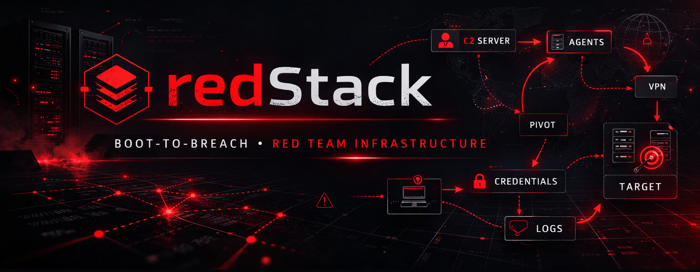

<!-- markdownlint-disable MD001 MD012 MD013 MD028 MD033 MD036 MD040 MD051 MD060 -->
<!-- Lint suppressions: GFM features (alerts, inline HTML, anchor slugs) and table style. -->
<!-- Documented rationale lives at assets/markdownlint.jsonc. -->

# redStack



> A self-contained Boot-to-Breach lab. Deploy a full red-team training environment with three C2 frameworks (Mythic, Sliver, Havoc), an Apache redirector, a Kali workstation, a Windows workstation, and a Guacamole portal. Two peered networks, header + URI gating, scanner blocking, optional OpenVPN routing for cyber ranges. Runs on **AWS**, **Azure**, or **Local VMs**.

**📖 Platform-specific documentation: [`Doc/AWS.md`](Doc/AWS.md) · [`Doc/Azure.md`](Doc/Azure.md) · [`Doc/Local.md`](Doc/Local.md)**

---

> [!IMPORTANT]
> redStack is not a tutorial on how to use C2 frameworks. It's an environment that removes the infrastructure hurdle so you can focus on learning. **This lab is strictly for authorized training and lab environments only** (cyber ranges, self-hosted environments, personal lab VMs, etc.). Not intended for use in real-world engagements or against targets you do not own and have explicit written permission to test.

> [!CAUTION]
> **AWS TOS: use at your own risk.** Hosting C2 infrastructure on AWS may raise concerns under the [AWS Acceptable Use Policy](https://aws.amazon.com/aup/). Before deploying, review the AUP and submit the [AWS Penetration Testing / Simulated Events request form](https://aws.amazon.com/security/penetration-testing/). As long as you're using redStack exclusively for personal lab work and authorized training platforms, you're generally in the clear. To be safe, run redStack from a dedicated, single-purpose throwaway AWS account.

---

## Platform Support

redStack runs on **three platforms**. Pick the one that fits your needs:

| Platform | Cost | Public IP for C2 | Deploy Time | Skill Level |
|----------|------|------------------|-------------|-------------|
| ☁️ [**AWS**](Doc/AWS.md) | ~$15-20/mo | Elastic IP (included) | ~45 min | Intermediate |
| 🔵 [**Azure**](Doc/Azure.md) | ~$25-35/mo | Static Public IP (included) | ~45 min | Intermediate |
| 💻 [**Local VMs**](Doc/Local.md) | Free (electricity) | Requires router port forward + DDNS | ~60-90 min | Advanced |

## Quick Start (AWS — most common)

```bash
cd AWS/terraform
cp terraform.tfvars.example terraform.tfvars
# Edit terraform.tfvars with your IP and key name
terraform init && terraform apply
```

Full guides: **[AWS](Doc/AWS.md)** · **[Azure](Doc/Azure.md)** · **[Local](Doc/Local.md)**

**Total time:** ~30-60 minutes on first deploy.

---

## What Gets Deployed

Seven virtual machines across two peered networks. Two have public IPs (Guacamole portal + redirector); everything else is reachable only through Guacamole.

| Hostname | Role | Services | Public |
|----------|------|----------|--------|
| `guac` | Guacamole portal | Web SSH/RDP/VNC | Yes (443) |
| `redirector` | Apache reverse proxy + C2 frontend | 80/443 only | Yes (80, 443) |
| `mythic` | Mythic C2 server | Docker, Mythic WebUI :7443 | No |
| `sliver` | Sliver C2 server | gRPC multiplexer :31337 | No |
| `havoc` | Havoc C2 server + desktop | Teamserver :40056, VNC :5901 | No |
| `windows` | Windows Server 2022 workstation | RDP :3389 | No |
| `kali` | Kali Linux workstation | SSH :22, XRDP :3389 | No |

See platform docs for specific instance sizing: **[AWS](Doc/AWS.md)** · **[Azure](Doc/Azure.md)** · **[Local](Doc/Local.md)**

---

## Cost

Costs vary by platform:

| Platform | Hourly | Monthly (5-10 hr/wk + destroy) | Monthly (24/7) |
|----------|--------|-------------------------------|----------------|
| **AWS** | ~$0.27/hr | ~$15-20/mo | ~$172/mo |
| **Azure** | ~$0.32/hr | ~$25-35/mo | ~$230/mo |
| **Local** | Free | Free (electricity only) | Free |

> [!CAUTION]
> Forgetting a deployed cloud lab is the #1 cause of unexpected bills. Set a billing alarm before your first `terraform apply`.

---

## Troubleshooting

See platform-specific troubleshooting sections:
- **[AWS Troubleshooting](Doc/AWS.md#9-troubleshooting)**
- **[Azure Troubleshooting](Doc/Azure.md#12-troubleshooting-azure-specific)**
- **[Local Troubleshooting](Doc/Local.md#10-troubleshooting-local-specific)**

Common issues: Mythic SSL cert warnings are expected (self-signed), Sliver needs disk space for Go compilation, Havoc needs 15-25 min for first build from source, and Kali user rename may vary by box version.

---

## Repository Layout

```
redStack/
├── README.md           This file (multi-platform landing page)
├── LICENSE             MIT + Commons Clause
├── assets/             Static images (banner)
│
├── AWS/                ☁️ Amazon Web Services deployment
│   └── terraform/      Terraform code + cloud-init scripts
│       ├── main.tf, variables.tf, outputs.tf
│       ├── security_groups.tf, redirector.tf
│       ├── sliver.tf, havoc.tf, kali.tf
│       ├── terraform.tfvars.example
│       └── setup_scripts/  10 cloud-init scripts
│
├── Azure/              🔵 Microsoft Azure deployment
│   └── terraform/      Terraform code (AzureRM provider)
│       ├── main.tf, variables.tf, outputs.tf
│       ├── security_groups.tf (NSGs)
│       ├── terraform.tfvars.example
│       └── setup_scripts/  Azure-adapted scripts
│
├── Local/              💻 Local VM deployment (Vagrant)
│   ├── Vagrantfile     7-VM VirtualBox cluster
│   ├── setup_scripts/  Local-adapted scripts
│   └── guac_share/     Guacamole file transfer folder
│
└── Doc/                📖 Platform documentation
    ├── AWS.md          Full AWS guide
    ├── Azure.md        Full Azure guide
    └── Local.md        Full Local VM guide
```

**Workflow per platform:**

| Platform | Deploy Command |
|----------|---------------|
| AWS | `cd AWS/terraform && terraform init && terraform apply` |
| Azure | `cd Azure/terraform && terraform init && terraform apply` |
| Local | `cd Local && vagrant up` |

---

## License

MIT License with Commons Clause. Free to use, deploy, modify, and share for any purpose.
Commercial use (selling redStack or building a paid product or service on it) requires
written permission.

For commercial licensing: [mike@devzerosecurity.com](mailto:mike@devzerosecurity.com). See [LICENSE](LICENSE) for full terms.
