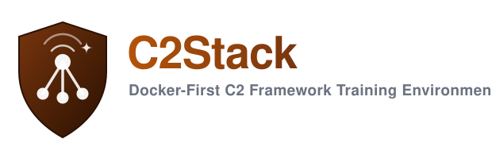
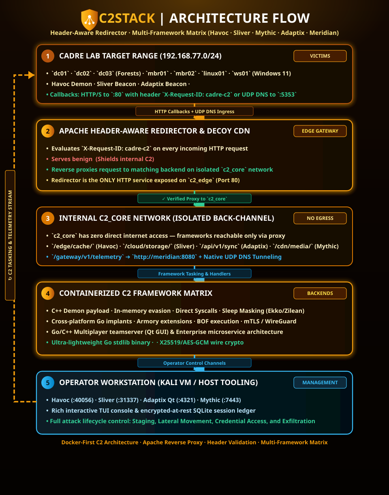

# C2Stack

<p align="center">
  
</p>

<p align="center">
  <a href="https://github.com/Ganron007/C2Stack"></a>
  <a href="https://github.com/Ganron007/C2Stack"></a>
  <a href="https://github.com/Ganron007/C2Stack"></a>
  <a href="https://github.com/Ganron007/C2Stack"></a>
</p>

C2Stack runs a header-aware **Apache redirector** in front of five C2 frameworks as Docker containers. Your existing **Kali VM** is the operator workstation — it runs the C2 clients and attack tooling, reaching the frameworks through published control ports.

- **Meridian + Sliver + Havoc** — start by default. No extra flags needed.
- **Mythic** — profile-gated (`--profile mythic`). Pulls upstream image.
- **Adaptix** — profile-gated (`--profile adaptix`). Builds from source (~5 min first run).

> [!NOTE]
> **Docker-First C2 Framework Training Environment** — a containerized practice range that turns any lab into a safe, multi-tier C2 playground with zero VM management overhead for backends.

---

## Architecture

<p align="center">
  
</p>

### Traffic Flow & OPSEC Boundaries

1. **Callback Initiation**: A payload on a victim calls back to `http://<host-ip-on-vmnet2>:<REDIRECTOR_HTTP_PORT>/<prefix>` with header `X-Request-ID: cadre-c2`, or sends UDP DNS TXT queries to `<host-ip-on-vmnet2>:<MERIDIAN_DNS_PORT>` (default `15353`, mapped to the container's `5353/udp` — Windows mDNS occupies 5353 on the host).
2. **Header Inspection**: The Apache redirector validates the header:
   - **Valid Header**: Proxies to the matching C2 container on the isolated `c2_core` network based on the URI prefix.
   - **Missing / Invalid Header**: Serves a benign **CloudEdge CDN Decoy Page** (shielding the teamservers from scanners and incident responders).
3. **Network Isolation**: The C2 containers live on an internal `c2_core` network with **zero direct internet egress** and are only reachable through the redirector.
4. **Out-of-band cloud C2 (Loki-style Azure Blob)**: *not part of this stack* — all C2Stack agents egress through the redirector (HTTP) or the Meridian DNS listener.

---

## Quick Start

Prerequisites:
- Docker Desktop running on the host (Windows / Linux / macOS).
- A Kali VM as the operator workstation (or host shell).
- Host reachable from the CADRE lab network (vmnet2, `192.168.77.0/24`).

```powershell
# Windows (Docker Desktop)
cd C2Stack\Docker
.\docker-bootstrap.ps1               # redirector + meridian + sliver + havoc (default)
.\docker-bootstrap.ps1 -Mythic       # also bring up Mythic
.\docker-bootstrap.ps1 -Adaptix      # also bring up Adaptix (builds from source)
.\docker-bootstrap.ps1 -All          # all frameworks
```

```bash
# Linux / macOS
cd C2Stack/Docker
./docker-bootstrap.sh               # redirector + meridian + sliver + havoc (default)
./docker-bootstrap.sh --mythic      # also bring up Mythic
./docker-bootstrap.sh --adaptix     # also bring up Adaptix (builds from source)
./docker-bootstrap.sh --all         # all frameworks
```

This copies `.env.example` → `.env`, builds the images, and starts the stack.

---

## Components

| Container | Role | C2 Port (Internal) | Operator / Control Port | Egress Transports |
|---|---|:---:|:---:|:---|
| **`portal`** | Flight Control & Visual Learning Hub | — | 8000 (Web UI / API) | Container control, OPSEC tracer, DNS dissector |
| **`redirector`** | Apache header-based proxy + decoy CDN | 80 (published) | — | HTTP / HTTPS Proxy |
| **`meridian`** | Dual-transport Go stdlib C2 + async Python daemon | 8080 (internal) | 15353/udp (DNS egress) | **HTTP(S) / WS + Chunked DNS TXT** |
| **`havoc`** | Havoc teamserver (C++ Demon evasion payload) | 80 | 40056 (Qt GUI) | HTTP / HTTPS / SMB |
| **`sliver`** | Sliver teamserver (Go implant + extensions) | 80 | 31337 (CLI / RPC) | mTLS / WireGuard / HTTP / DNS |
| **`adaptix`** | Adaptix teamserver (Multiplayer Go + Qt GUI) | 80 | 4321 (Qt GUI) | HTTP/S / DNS / SMB / TCP Gopher |
| **`mythic`** | Mythic core: server + postgres + rabbitmq | 80 | 7443 (Web UI/API) | http C2 profile via mythic-cli (Linux host) |

---

## Flight Control & Learning Hub (`http://localhost:8000`)

C2Stack ships with an integrated web management and educational portal:
- **Container Stack Controller**: Real-time health monitoring and 1-click lifecycle controls (start, stop, restart, logs) for all 6 containers via Docker socket integration.
- **Live OPSEC Redirector Visualizer**: Interactive packet flow tracing verifying `X-Request-ID: cadre-c2` routing into `c2_core` vs. scanner redirection to the **CloudEdge CDN Decoy Page**.
- **Meridian DNS Covert Channel Dissector**: Educational waterfall showing Base32 chunking (RFC 1035 labels), sequence tracking, and wire encryption over UDP 5353.
- **Cross-Framework Payload Studio**: One-click copy for PowerShell stagers, bash commands, and binary compilations across all 5 frameworks with detection metadata (Sysmon Event IDs, Sigma signatures).
- **Active Fleet Radar**: Unified live session table aggregating active beacons across Meridian, Sliver, and Havoc.

---

## Framework Highlights


### 1. Meridian C2 — Lightweight Dual-Transport & DNS Tunneling
- **Zero-Dependency Implant**: Pure Go (`parallax`), stdlib only (`crypto/ecdh`, `crypto/aes`). Compiles anywhere in seconds.
- **Native DNS TXT Tunneling**: Uppercase Base32 chunking (36-byte packets) over UDP (container `5353/udp`, host default `15353`). Ideal for restricted network egress practice and DFIR-Nexus DNS telemetry evaluation.
- **Wire Cryptography**: X25519 Diffie-Hellman + HKDF-SHA256 derivation + AES-256-GCM AEAD envelopes binding messages to session IDs.
- **Encrypted-at-Rest Results**: SQLite results encrypted under the server master key.

### 2. Havoc C2 — Windows Endpoint Evasion
- C++ Demon payload with indirect syscalls, API hashing, in-memory execution, and sleep obfuscation (Ekko/Zilean).
- Connects to the published teamserver port (`40056`) using the Havoc Qt5 client.

### 3. Sliver C2 — General Lateral Movement
- Feature-rich Go implants supporting Armory extensions, BOFs, and pivot listeners (TCP / SMB).
- Controlled via `sliver-client` on port `31337`.

### 4. Adaptix C2 — Multiplayer Operations
- Go/C++ post-exploitation framework with a Qt GUI client (`:4321`).
- Multi-listener matrix: HTTP/S, DNS/DoH, SMB, TCP Beacon + TCP/mTLS Gopher.

---

## Documentation & Guides

- **[Field Practice & Study Guide](Doc/PRACTICE-GUIDE.md)** — Complete step-by-step tutorial, Flight Control visual cockpit walkthrough, hands-on lab modules, DNS covert tunneling dissection, and DFIR-Nexus detection synergy.
- **[Docker Architecture Reference](Doc/Docker.md)** — In-depth container layout, listener tuning, volume persistence, and isolation mechanics.

## Acknowledgments & Credits

C2Stack stands on the shoulders of the offensive security and open-source research community:

- **Meridian C2**: Created by [s1d9e](https://github.com/s1d9e) ([https://github.com/s1d9e/meridian](https://github.com/s1d9e/meridian)) — an exceptional, elegant from-scratch C2 framework featuring zero-dependency Go implants (`parallax`), native chunked DNS TXT tunneling, and clean X25519/AES-GCM wire cryptography. We deeply appreciate this fantastic independent student research work that powers C2Stack's native covert egress and educational dissector.
- **Havoc C2**: Created by Paul Ungur ([@C5pider](https://github.com/C5pider)) and the Havoc Framework contributors.
- **Sliver C2**: Created by [Bishop Fox](https://github.com/BishopFox/sliver).
- **Adaptix C2**: Created by the [Adaptix-Framework](https://github.com/Adaptix-Framework/AdaptixC2) team.
- **Mythic C2**: Created by Cody Thomas ([@its_a_feature_](https://github.com/its-a-feature/Mythic)).

## Licensing

This project vendors or references third-party C2 software with distinct
license terms (GPL-3.0 for Havoc, Adaptix, and Sliver; BSD-3-Clause for
Mythic; MIT for Meridian). Upstream license texts ship inside the vendored trees; see
**[THIRD_PARTY_NOTICES.md](THIRD_PARTY_NOTICES.md)** for the full
attribution and modification notices. C2Stack original code is MIT (with
Commons Clause) per the root `LICENSE`.

